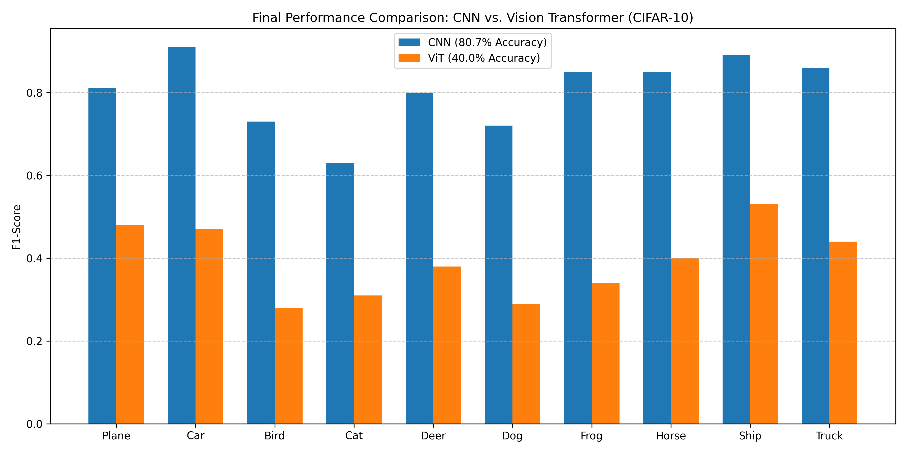

# Comparative Study: Inductive Bias vs. Global Attention on CIFAR-10

## 1. Project Overview
This research explores the fundamental architectural trade-off in Computer Vision: the **local inductive bias** of Convolutional Neural Networks (CNNs) versus the **global self-attention** of Vision Transformers (ViTs). Using the CIFAR-10 dataset as a benchmark, this project evaluates model performance under data-constrained conditions. The workflow transitions from a locally engineered, high-accuracy CNN baseline to a cloud-executed ViT experimentation phase, culminating in a hybrid architectural solution.

---

## 2. Comparative Analysis & Insights
The disparity in results below highlights the "Data-Hunger" of Transformers when compared to the spatial efficiency of CNNs.

| Metric | CNN (Local Baseline) | Vision Transformer (Hybrid) |
| :--- | :--- | :--- |
| **Final Accuracy** | **80.74%** | **40.00%** |
| **Best Performing Class** | Automobile (91% F1) | Ship (53% F1) |
| **Worst Performing Class** | Cat (63% F1) | Bird (28% F1) |
| **Inductive Bias** | High (Spatial Locality) | Low (Needs more data) |
---
### 📈 Visual Comparison: Performance Metrics

**Key Insight:** The ViT outperformed its own average on **Ships and Planes**, suggesting it successfully captured global background context (sea/sky). However, the CNN dominated in **Biological classes (Bird/Cat/Dog)**, where local texture and edge detection are critical—features the ViT struggled to learn from small-scale 32x32 images without massive pre-training.

---

## 3. The Development Journey

### The CNN Journey: Local Engineering Mastery
The CNN phase was a rigorous exercise in hardware and software synchronization. Working locally on a Windows machine, I addressed real-world engineering bottlenecks, including **CUDA multiprocessing bugs** and **GPU memory management**. The project was an iterative process: early instability led to the integration of **Batch Normalization** after every convolution, which stabilized gradient flow and allowed the model to reach its 80.74% peak. Visualizing the first-layer filters confirmed the model successfully evolved from random noise into structured edge detectors (Gabor-like filters).

### The ViT Journey: Cloud-Based Architectural Innovation
Moving to Google Colab to leverage high-memory GPUs, the ViT phase focused on architectural scaling. The primary challenge was the **Quadratic Complexity** of self-attention and the model's inherent "data-hunger." To bridge the performance gap, I engineered a **Hybrid CNN Stem** to provide the Transformer with early spatial priors. This phase involved deep hyperparameter tuning, utilizing **Overlap Patching** and **Cosine Annealing** to force a model—which usually requires millions of images—to converge on the small-scale CIFAR-10 dataset.

---

## 4. Technical Specifications

### CNN Technical Details
* **Architecture:** 4x (Conv → BatchNorm → ReLU → MaxPool) blocks with a Dropout-stabilized MLP head.
* **Optimizer:** Adam with Cross-Entropy Loss, implemented via modular Python scripts for training/eval.
* **Hardware:** Locally executed on NVIDIA GPU with CUDA-accelerated tensor computations.
* **Analysis:** Includes Confusion Matrices, Per-class F1-scores, and Filter Visualization reports.

### ViT Technical Details
* **Architecture:** From-scratch ViT with 16x16 Patch Embeddings and 12-layer Transformer Encoders.
* **Hybrid Features:** Implemented a 3-layer Convolutional Stem and Overlap Patching (stride < kernel).
* **Optimization:** AdamW optimizer with weight decay (0.05) and Cosine Annealing learning rate schedule.
* **Hardware:** Cloud-executed on Google Colab GPUs to manage quadratic attention complexity.

